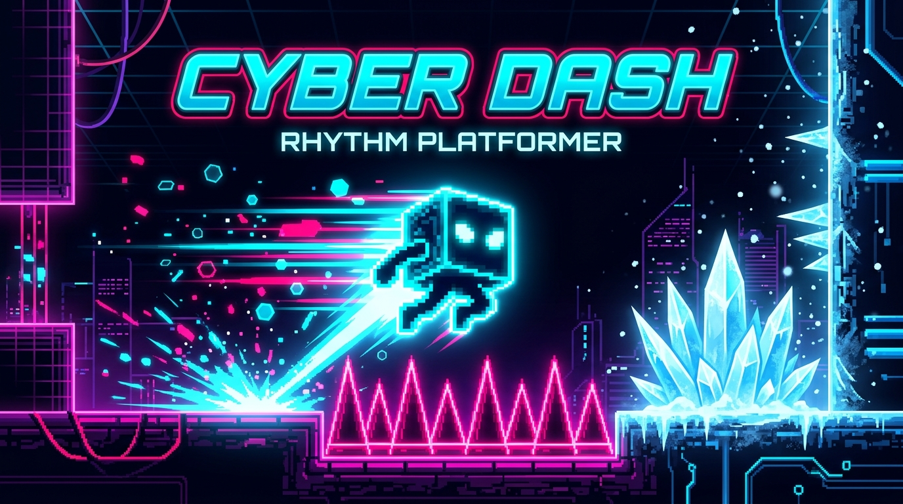
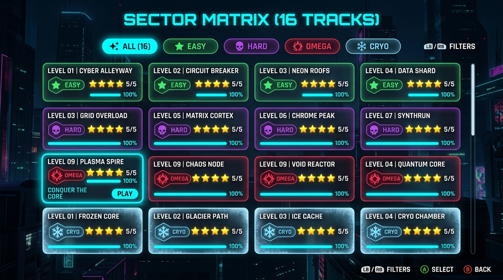
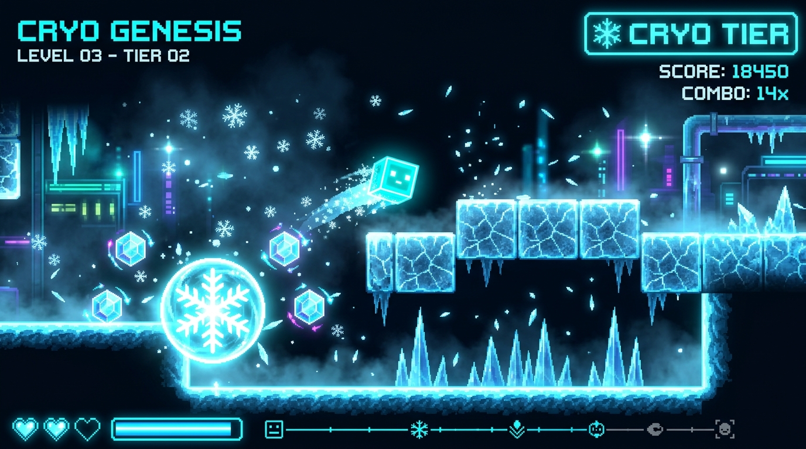

# 🎮 CYBER DASH — Neon Rhythm Platformer

<p align="center">
  
</p>

<p align="center">
  
  
  
  
  
</p>

<p align="center">
  <strong>A high-octane cyberpunk rhythm platformer built in vanilla HTML5 Canvas + JavaScript.</strong><br>
  Dash through 16 neon-drenched levels across 4 tiers — including the all-new CRYO sector.
</p>

## 📑 Table of Contents
- [Screenshots](#screenshots)
- [Features](#features)
- [Object Types Catalog](#object-types-38-total)
- [CRYO Ice Tier](#cryo-tier-new-in-v20)
- [Level Tiers Matrix](#level-tiers-16-total)
- [Controls](#controls)
- [Getting Started](#getting-started)
- [Documentation Suite](#-documentation-suite)
- [Project Structure](#project-structure)
- [Contributing](#contributing)
- [License](#license)

---

## Screenshots

<table>
  <tr>
    <td align="center"><br><sub><b>Level Select — Sector Matrix (16 Tracks)</b></sub></td>
    <td align="center"><br><sub><b>CRYO GENESIS — Ice Tier Gameplay</b></sub></td>
  </tr>
</table>

---

## Features

### Core Gameplay
- **6 Player Forms** — CUBE, SHIP, UFO, WAVE, BALL, ROBOT with unique physics
- **Tap/Click/Space** to jump, activate orbs, and chain moves
- **Neon-reactive** audio engine with procedural BPM-locked music (120–180 BPM)
- **Practice Mode** — retry from checkpoints to master hard sections
- **Custom Level Editor** — build and play your own sectors

### Object Types (38 Total)
| Category | Objects |
|---|---|
| Platforms | Block, Half-Block, Ice Block |
| Hazards | Spike, Ice Spike, Sawblade |
| Jump Orbs | Yellow, Pink, Red, Blue, Green, Black, **Freeze Orb** |
| Pads | Yellow, Pink, Red, Blue, **Ice Pad**, **Boost Pad** |
| Portals | Ship, Cube, UFO, Wave, Ball, Robot, Mini, Mega, Grav-Inv, Grav-Norm |
| Speed | 0.5x, 1x, 2x, 3x, 4x Speed Gates |
| Collectibles | Cyber Coin, **Ice Crystal** |
| New | **Freeze Zone**, **Dash Ring** |

### CRYO Tier (NEW in v2.0)


- **Slippery ICE_BLOCK** platforms with frost crack rendering
- **ICE_SPIKE** hazards with crystalline gradient facets and tip sparkle
- **ORB_FREEZE** — freeze-jump that slows player for 2 seconds
- **Freeze Vignette** — blue edge glow on screen while frozen
- **Ice crystal overlay** rotates around player when frozen
- **Falling snowflakes** and icy mist atmospheric CRYO background
- **4 CRYO Levels:** CRYO GENESIS, FROST MATRIX, ARCTIC PULSE, ABSOLUTE ZERO

### Level Tiers (16 Total)
| Tier | Count | Difficulty | Theme |
|---|---|---|---|
| EASY | 4 | 1–2 stars | Intro neon cyber |
| HARD | 4 | 3–4 stars | Synthwave + sawblades |
| OMEGA | 4 | 5–7 stars | All forms, max BPM |
| CRYO | 4 | 2–7 stars | Ice, freeze, sub-zero |

---

## Controls

| Action | Keyboard | Mouse | Touch |
|---|---|---|---|
| Jump / Activate | `Space` | Left Click | Tap |
| Pause | `Esc` | — | — |
| Retry | `R` | — | — |

---

## Getting Started

Open **`index.html`** in any modern browser. No build step or server required.

```bash
# Clone the repository
git clone https://github.com/Pierreg99/cyberdash.git
cd cyberdash

# Run directly in browser (Windows)
start index.html

# Run directly in browser (macOS / Linux)
open index.html

# Optional: Run local static server
npm start
```

**Requirements:** Chrome / Firefox / Edge / Safari 15+

---

## 📚 Documentation Suite

| Document | Description |
|---|---|
| **[QUALITY_AUDIT.md](QUALITY_AUDIT.md)** | Full technical audit, 60/120 FPS benchmarks, physics verification, and test results |
| **[PLAN.md](PLAN.md)** | High-level system architecture, engine decomposition, and technical implementation plan |
| **[PROGRESS.md](PROGRESS.md)** | Granular milestone tracking across v1.0, v1.5, and v2.0 releases |
| **[ROADMAP.md](ROADMAP.md)** | Strategic vision and planned features for v2.1, v2.2 (Inferno Tier), and v3.0 |
| **[CHANGELOG.md](CHANGELOG.md)** | Semantic release notes and historical changes |
| **[CONTRIBUTING.md](CONTRIBUTING.md)** | Community guidelines, custom level authoring specs, and PR instructions |
| **[docs/ARCHITECTURE.md](docs/ARCHITECTURE.md)** | Detailed subsystem architecture, game loop lifecycle, and data flow diagrams |
| **[docs/PHYSICS_ENGINE.md](docs/PHYSICS_ENGINE.md)** | Mathematical specification of kinematics, collision AABB, and freeze slow curves |
| **[docs/LEVEL_DESIGN_GUIDE.md](docs/LEVEL_DESIGN_GUIDE.md)** | Track authoring guide for all 38 object types, pacing, and BPM rhythm sync |
| **[docs/API_REFERENCE.md](docs/API_REFERENCE.md)** | Developer reference for Player, Physics, Particles, Camera, and Audio modules |
| **[docs/AUDIO_SYSTEM.md](docs/AUDIO_SYSTEM.md)** | Web Audio API procedural synthesis, oscillator chains, and rhythm scheduling |

---

## Project Structure

```
cyberdash/
├── index.html                  # Game shell & UI
├── css/styles.css              # Core styles, glassmorphism, CRYO theme
├── js/
│   ├── main.js                 # Game loop, CyberDashGame orchestrator
│   ├── engine/
│   │   ├── physics.js          # 38 object types, collision detection & freeze logic
│   │   ├── player.js           # 6 forms kinematics & orbital crystal overlay
│   │   ├── particles.js        # Explosions, ice shatter, frost shockwave rings
│   │   └── camera.js           # Viewport tracking, screen shake & weather effects
│   ├── levels/
│   │   ├── level-data.js       # 16 official sectors + vector object renderer
│   │   └── editor.js           # Interactive in-game level builder
│   ├── ui/
│   │   ├── menu-manager.js     # Sector matrix, tier cards, store & garage
│   │   └── storage.js          # LocalStorage persistence & stats manager
│   └── audio/
│       └── sound-engine.js     # Web Audio API procedural music & SFX synth
├── docs/                       # Technical manuals, guides & screenshots
├── QUALITY_AUDIT.md            # Codebase audit & benchmark report
├── PLAN.md                     # Architecture & implementation plan
├── PROGRESS.md                 # Milestone tracker
├── ROADMAP.md                  # Future roadmap
├── CHANGELOG.md                # Release changelog
├── CONTRIBUTING.md             # Contribution guide
└── LICENSE                     # MIT License
```

---

## Contributing

We welcome community level creators and developers! See [CONTRIBUTING.md](CONTRIBUTING.md) for full guidelines.

---

## License

This project is licensed under the **MIT License** — see [LICENSE](LICENSE) for details.

---

<p align="center">Made with neon by <a href="https://github.com/Pierreg99">Pierreg99</a> · 2026</p>

